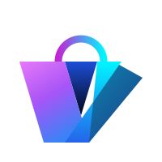

<!-- Animated top banner -->
<p align="center">
  
</p>

<!-- Logo -->
<p align="center">
  
</p>

<!-- Typing animation -->
<p align="center">
  
</p>

<!-- Tech badges -->
<p align="center">
  
  
  
  
  
</p>

<p align="center">
  A premium fashion e-commerce UI built to demonstrate advanced React, animation, and interaction design skills.<br/>
  <strong>This project is a frontend portfolio piece</strong> — not a production store.
</p>

<p align="center">
  🔗 <strong>Live Demo:</strong> <a href="https://vyapara-k.netlify.app">vyapara-k.netlify.app</a>
</p>

<!-- Wave separator -->


---

## 🎯 What This Demonstrates

This project was built to push the boundaries of what a React frontend can feel like — going far beyond typical CRUD UIs into the territory of high-end, interactive product experiences.

| Skill Area | Implementation |
|------------|---------------|
| **Advanced Animation** | Framer Motion — scroll-driven storytelling, spring physics, layout animations, infinite keyframes |
| **3D CSS + Mouse Tracking** | Holographic card tilt using `perspective`, `rotateX/Y`, and real-time mouse position math |
| **Custom Touch Gestures** | Pull-to-refresh with elastic damping, swipe-snap scroll — no library, written from scratch |
| **State Architecture** | React Context for Cart, Auth, and Atmosphere — clean separation of concerns |
| **Design Systems** | Tailwind CSS utility-first with custom design tokens, shimmer animations, and glassmorphism |
| **Performance** | `will-change`, `translateZ` for GPU compositing, lazy image loading, `useTransform` for 60fps scroll |
| **Responsive Design** | Desktop layout + floating mobile dock + phone-accessible dev server |
| **Component Design** | Fully reusable, isolated components with no prop drilling |

---

## ✨ Highlighted Features

### 🃏 Holographic 3D Product Cards
Product cards physically tilt on a 3D axis tracking your cursor in real time. The border angle rotates as the card tilts, creating a shimmering iridescent effect. Built with raw mouse math — no library.

```jsx
const rotateX = ((y - centerY) / centerY) * -12;
const rotateY = ((x - centerX) / centerX) * 12;
style={{ transform: `perspective(900px) rotateX(${rotateX}deg) rotateY(${rotateY}deg)` }}
```

---

### 🔍 AI Command Palette
A Spotlight-style overlay triggered by the search icon. Users type natural language queries like *"minimal beach wedding outfit under $200"* — results cascade in with staggered motion and a live running outfit total updates on every keystroke.

---

### 🌌 4-Mode Atmosphere Switcher
A settings system that morphs the site's entire visual identity in real time — background gradients, animated blob colors, and border tints all transition smoothly over 1.2s when you switch themes:
- 🌌 **Deep Cosmos** — midnight blue with cyan/violet
- ⚡ **Neon Cyberpunk** — magenta + acid green
- ✦ **Cosmic Void** — near-pitch black, ghost-white
- ◻ **Studio Glass** — frosted ice-blue

---

### 🎬 Scroll-Driven Product Storytelling
On desktop, the product detail page uses `useScroll` + `useTransform` from Framer Motion to drive a parallax image that scales and rotates as you scroll. Story panels (Design → Material → Fit → Craft) fade in via `AnimatePresence` synced to scroll position.

---

### 👆 Pull-to-Refresh (Custom Hook)
A fully custom touch gesture system — no third-party library. Detects `touchstart` at `scrollY === 0`, applies elastic damping (`delta * 0.45`), renders a circular SVG progress ring, and triggers a reload when the pull threshold is crossed.

---

### 💀 Premium Shimmer Skeletons
Loading states that perfectly mirror the real card's layout — same dimensions, same rounded corners — with a `105deg` diagonal shimmer sweeping across, implemented entirely in CSS `@keyframes`.

---

## 🛠 Tech Stack

| Tool | Purpose |
|------|---------|
| **React 18** | Component architecture, hooks, context |
| **Vite 6** | Lightning-fast dev server and HMR |
| **Tailwind CSS** | Utility-first styling + custom design tokens |
| **Framer Motion** | Animations, gestures, layout transitions, scroll transforms |
| **React Router v6** | Client-side routing |
| **Outfit (Google Fonts)** | Premium geometric typeface |
| **Axios** | API client with JWT interceptors |

---

## 🚀 Running Locally

```bash
# Clone the repo
git clone https://github.com/kkeshaw/Vyapara.git
cd Vyapara

# Start the backend (optional — app works in demo mode without it)
cd backend
python3 -m venv .venv && source .venv/bin/activate
pip install -r requirements.txt
cp .env.example .env
python3 manage.py migrate && python3 manage.py runserver

# Start the frontend
cd ../frontend
npm install
cp .env.example .env
npm run dev
```

Open → **http://localhost:5173**

### Run on Phone (same WiFi)
```bash
npm run dev -- --host
# Then open http://<your-ip>:5173 on your phone
```

---

## 📁 Frontend Structure

```
src/
├── components/
│   ├── ProductCard.jsx       # 3D holographic tilt card
│   ├── CommandPalette.jsx    # AI search overlay
│   ├── AtmospherePicker.jsx  # Theme switcher dropdown
│   ├── CartDrawer.jsx        # Slide-in cart panel
│   ├── MobileDock.jsx        # Floating phone nav
│   ├── HeroSection.jsx       # Animated liquid blob hero
│   ├── SkeletonCard.jsx      # Shimmer loading states
│   └── ProductSection.jsx    # Snap-scroll card row
├── context/
│   ├── AtmosphereContext.jsx # Global theme state
│   ├── CartContext.jsx       # Cart + drawer state
│   └── AuthContext.jsx       # JWT auth state
├── hooks/
│   └── usePullToRefresh.js   # Custom touch gesture hook
├── pages/
│   └── ProductDetailPage.jsx # Scroll-driven storytelling
└── styles/
    └── index.css             # Design tokens, shimmer keyframes
```

---

## 👤 About

Built by **Keshaw** as a personal frontend skills showcase.  
Exploring the intersection of motion design, interaction engineering, and modern React patterns.

---

## 📝 License

MIT — open for inspiration, learning, or forking.

<!-- Animated bottom wave -->

